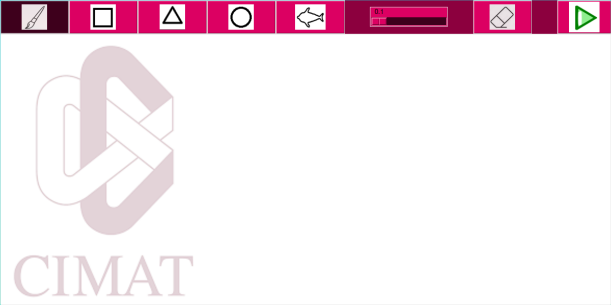

#meshGenerator
This program offers a GUI to paint/draw any loop that the user desires, and then
creates a real time simulation of said object being submerged in a fluid of certain 
speed and viscosity. It was Developed during the summer program DELFIN 2024 as a project
for said program, led by Doctor Miguel Angel Uh Zapata.

#Dependencies
**We are assuming that for MacOS the [Homebrew](https://brew.sh/) package manager is installed
and that Windows users have the [Chocolatey](https://chocolatey.org/install) package manager.
If this is not your case, please install them before continuing.**

To utilize this project it will be neccesary to install a few programs and libraries.
##python, gcc/g++ and gfortran
These are compilers for all the languages that the program uses. python and GCC are fairly common 
to have installed by default in Linux distributions, but gfortran not as much.
###on Debian based distributions, run
`sudo apt-get install gfortran`
###On Arch-based distributions run 
`sudo pacman -S gcc-fortran`
You will need to install gcc on MacOS. To do so run
`brew install gcc`
and then 
`brew install gfortran`
for Windows, run
`choco install minGW`
and then
`choco install gfortran`

##Pillow
This project works with the lecture and creation of images, so the Pillow library from
Python will be neccessary. To install it, run 
`pip install pillow`
##Tkinter
Also, most Python versions already have Tkinter installed, but if the library is missing
From your environment run 
`pip install tk`
As well.
##Make
Make is strongly recommended to compile the project.A lot of Linux distributions already have 
gcc/make installed by default, and if you already have gcc you should have make as well. If not,
on Windows you will need to run
`choco install make`
and on MacOS
`brew install make`

#Compiling and running the project
Esta parte le toca a Manuel :p 

#Using the project
Once it is running, the following window will be displayed

In here you can draw a variety of loops, and change the viscosity
of the fluid. Once you have a drawing you're satisified with, click the 
**run button**, and a simulation such as this will begin to play
SIMULATION HERE
If you wish to make more shapes, you can do so. Click run again when you're
finished, and the simulation will adapt to the new objects. If you wish to 
redo the drawing click the clear button; this will **completely** clear the 
canvas and restart the simulation.

#Credits
Miguel Angel Uh Zapata
Gortarez Blanco Manuel Eduardo
Medina Lugo Fausto Misael
Bruno
Hannia

